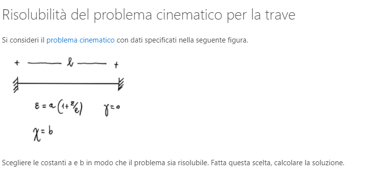
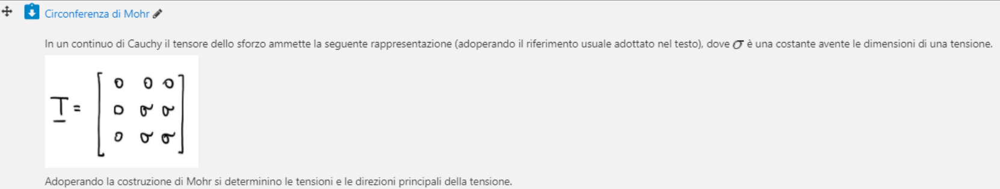

# Esercitazioni di Scienza delle Costruzioni per Ingegneria Meccanica AA2019-20

A cura di **Annalisa Genovesi**

## Problema cinematico per sistemi di corpi rigidi

### Determinazione della matrice cinematica Es. 2.1 Casini Vasta 3a edizione

Svolgimento: [Esercizio E2.1.pdf](Esercizio E2.1.pdf) 

## Problema statico per sistemi di corpi rigidi

### Esercizio 3-1 Casini Vasta 3a edizione

Svolgimento: [Esercizio 3.1.pdf](Esercizio 3.1.pdf) 

## Problema cinematico per la trave

### Problema cinematico

Svolgimento: [Problema cinematico della trave.pdf](Problema cinematico della trave.pdf) 

### Risolubilità del problema cinematico per la trave

Svolgimento: [Risolubilità problema cinematico.pdf](Risolubilità problema cinematico.pdf) 

## Statica della trave

### Altri schemi statici ricorrenti

Svolgimento: [Altri schemi statici.pdf](Altri schemi statici.pdf) 

### Diagrammi per la struttura dell'esercizio 3-20 Casini-Vasta 3a edizione

Svolgimento: [Esercizio 3-20.pdf](Esercizio 3-20.pdf) 

### Statica delle travature

Svolgimento: [Statica della trave.pdf](Statica della trave.pdf) 

### Diagrammi delle caratteristiche della sollecitazione

Limitandosi ad esporre i passaggi principali, determinare le caratteristiche della sollecitazione della seguente struttura.

Svolgimento: [diagrammi caratteristiche sollecitazione.pdf](diagrammi caratteristiche sollecitazione.pdf) 

### Diagrammi per la struttura dell'esercizio E3-8 (Casini Vasta 3a edizione)

Svolgimento: [diagrammi esercizio 3-8.pdf](diagrammi esercizio 3-8.pdf) 

### Esercizio sui diagrammi

Svolgimento:  [esercizio sui diagrammi.pdf](esercizio sui diagrammi.pdf) 

### Esercizio E6-6 Casini-Vasta 3a edizione

Nota: la figura è tratta dall'esercizio 3-6, ed è uguale a quella dell'es. 6-6.

Svolgimento: [Esercizio E6-6.pdf](Esercizio E6-6.pdf) 

### Diagramma del taglio e del momento

Svolgimento:  [diagramma taglio momento.pdf](diagramma taglio momento.pdf) 

## Linea elastica

### Integrazione della equazione della linea elastica

Svolgimento: [linea elastica.pdf](esercitazioni_annalisa_genovesi\Esercizi consegnati Scienza delle Costruzioni\linea elastica.pdf) 

### Dettagli Esercizio 9.4 4a ed

Risolvere con il metodo che si preferisce il sistema lineare dell'esercizio 9.7 rispetto alle incognite c1,c2,c3,c4

Per chi ha l'accesso al testo, l'esercizio è disponibile presso questo link: https://www.pandoracampus.it/doi/10.978.8825/175141/_12_17___titoletto_102

Svolgimento:  [Dettagli esercizio 9.7 4a.pdf](Dettagli esercizio 9.7 4a.pdf) 

## Principio dei lavori virtuali

### Calcolo di spostamenti e rotazioni in strutture iperstatiche delle quali si conoscono le sollecitazioni

Svolgimento: [spostamenti iperstatica.pdf](spostamenti iperstatica.pdf) 

## Metodo delle forze

### Esercitazione sul metodo delle forze

Adoperando il metodo delle forze si determinino le reazioni vincolari della struttura in figura. Si tracci quindi il diagramma del momento flettente.

Svolgimento:  [metodo delle forze.pdf](metodo delle forze.pdf) 

### Trave continua su due campate svolta col metodo delle forze

Svolgimento: [trave continua due campate.pdf](trave continua due campate.pdf) 

### Telaio incernierato e telaio incastrato

Svolgimento: [telaio.pdf](telaio.pdf) 

## Travature reticolari e travi continue

### Risoluzione di una travatura reticolare mediante il metodo dei nodi

Svolgimento: [metodo nodi.pdf](metodo nodi.pdf) 

## Analisi della deformazione

### Prerequisiti: gradiente di un campo vettoriale

Svolgimento: [gradiente.pdf](gradiente.pdf) 

### Utilizzo dei cerchi di Mohr per studiare la deformazione

Svolgimento:  [Cerchi di Mohr per la deformazione.pdf](Cerchi di Mohr per la deformazione.pdf) 

## Analisi dello sforzo

### Circonferenza di Mohr

Svolgimento:  [Circonferenza di Mohr.pdf](Circonferenza di Mohr.pdf) 

## Legame costitutivo

### Legame costitutivo elastico lineare isotropo

### Problema: Legame inverso

Svolgimento: [legame inverso.pdf](legame inverso.pdf) 

## Problema dell'equilibrio in elasticità tridimensionale

Formulazione del problema dell'equilibrio per una sfera elastica sotto pressione

Svolgimento: [equilibrio elastico sfera.pdf](equilibrio elastico sfera.pdf) 

