# Esercitazioni AA 2020-21 (A cura di Alessandro Barletta)

## Esercitazione 1 (cinematica dei sistemi di corpi rigidi)

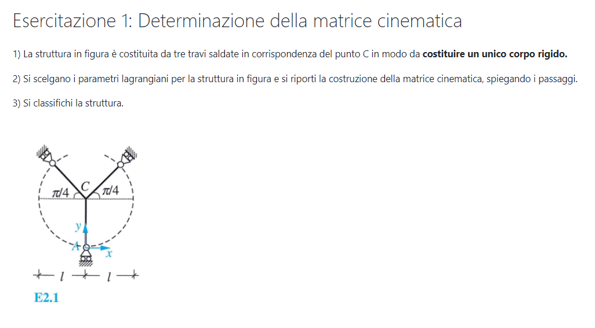 

[Svolgimento esercitazione 1](esercitazione1.pdf) 

## Esercitazione 2 (statica dei sistemi di corpi rigidi)

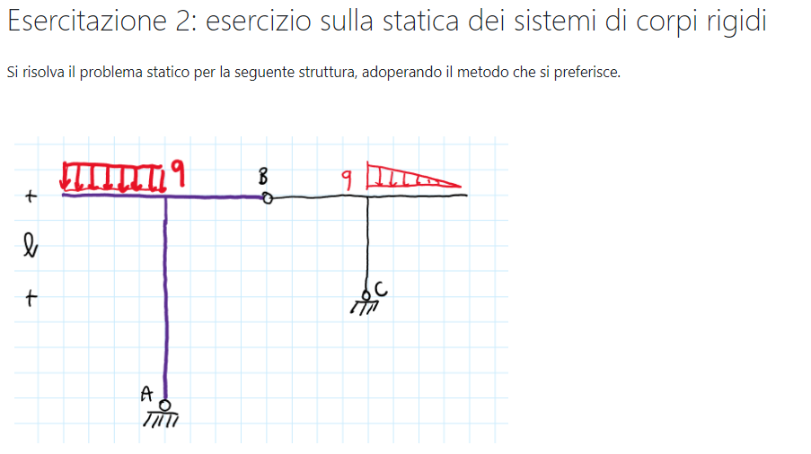

 [Svolgimento esercitazione 2](esercitazione2.pdf) 

## Esercitazione 3 (schemi notevoli)

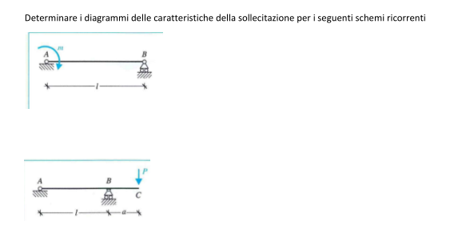

 [Svolgimento esercitazione 3](esercitazione03.pdf) 

## Esercitazione 4 (metodo degli spostamenti)

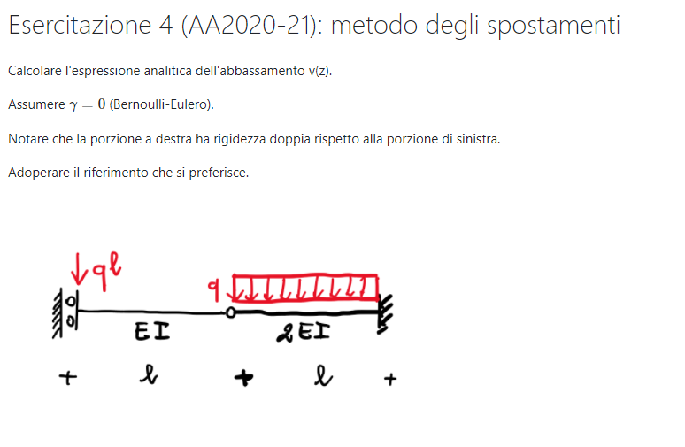

 [Svolgimento esercitazione 4.pdf](esercitazione04.pdf) 

## Esercitazione 5 (schemi notevoli)

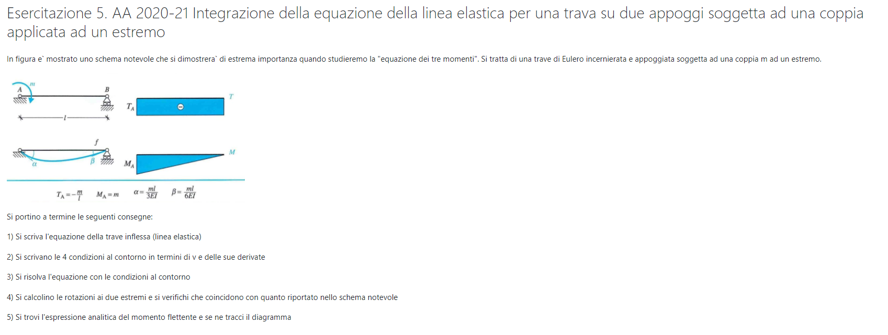

 [Svolgimento esercitazione 5.pdf](esercitazione05.pdf) 

## Esercitazione 6 (principio dei lavori virtuali)

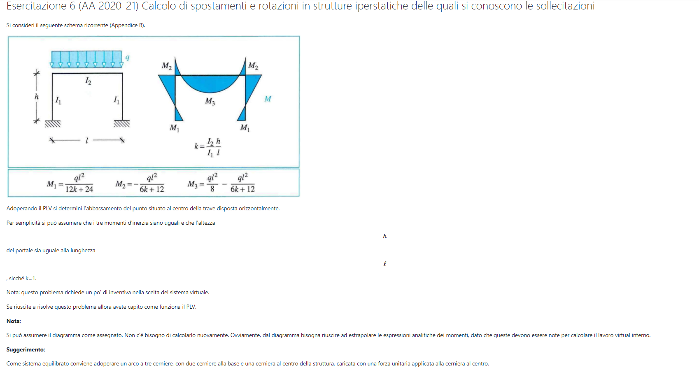

 [Svolgimento esercitazione 6](esercitazione06.pdf) 

## Esercitazione 7 (metodo delle forze)

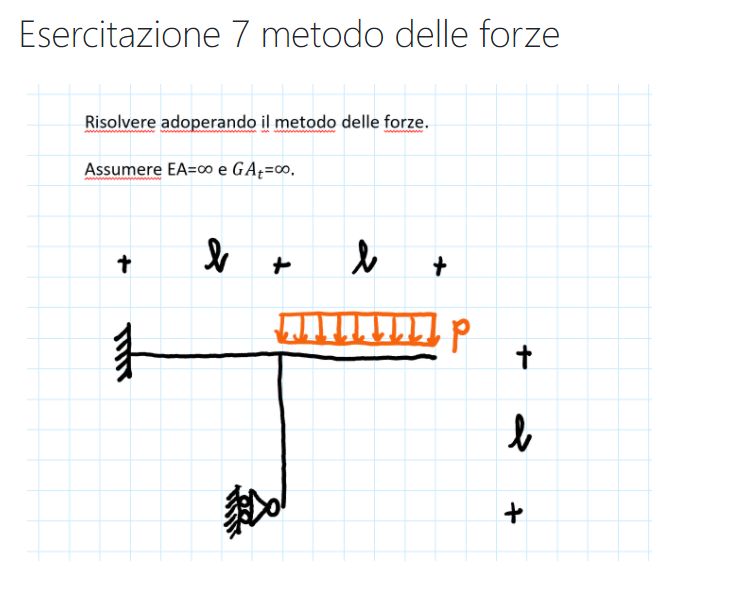

 [Svolgimento esercitazione 7](esercitazione07.pdf) 

## Esercitazione 8

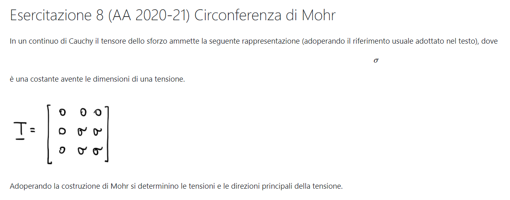

 [Svolgimento esercitazione 8](esercitazione08.pdf) 

## Esercitazione 9

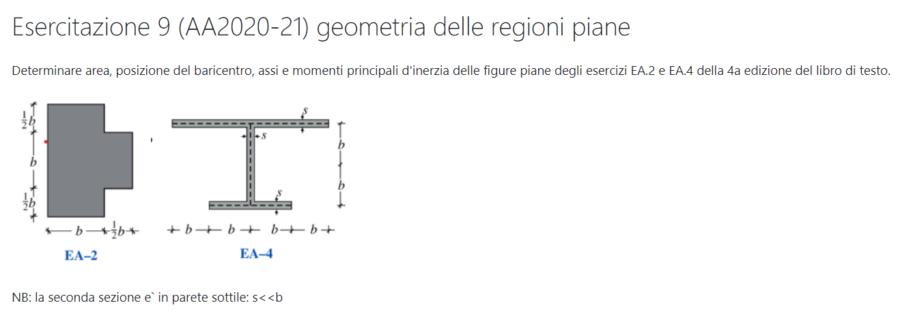

 [Svolgimento esercitazione 9](esercitazione09.pdf) 

## Esercitazione 10

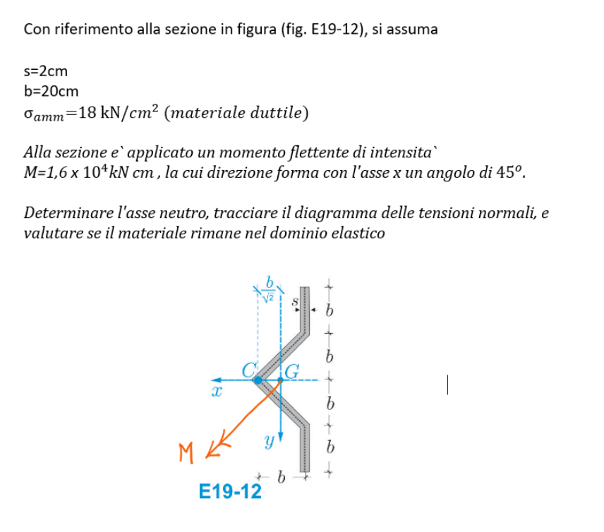

 [Svolgimento esercitazione 10](esercitazione10.pdf) 

## Esercitazione 11

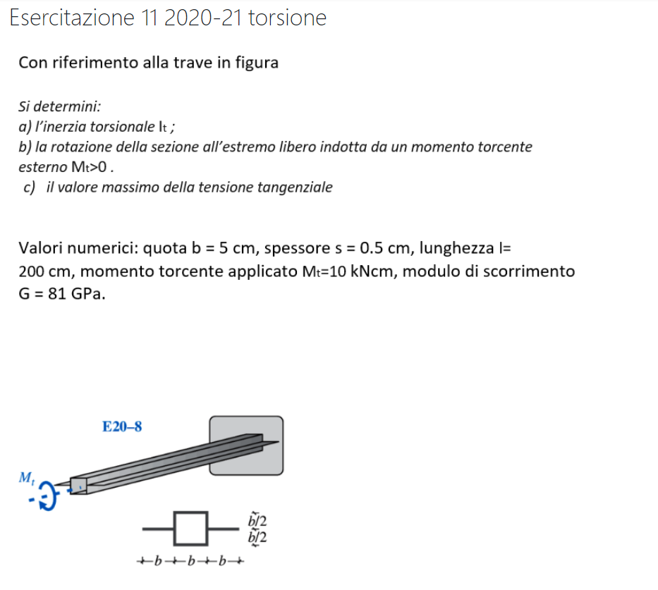

[Svolgimento esercitazione 11](esercitazione11.pdf) 

## Esercitazione 12

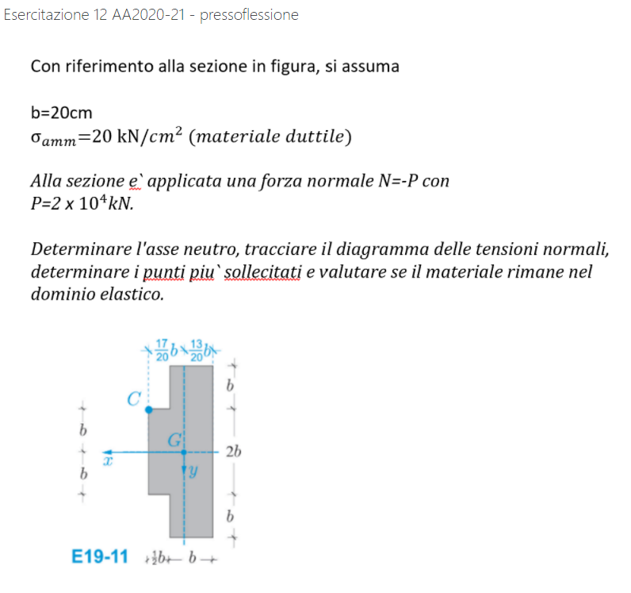

 [Svolgimento esercitazione 12](esercitazione12.pdf) 

