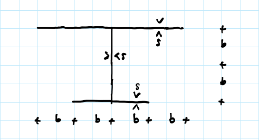

## Esercitazione 1

 [Svolgimento esercitazione 1](Esercitazione 1.pdf) 

---

## Esercitazione 2

 [Svolgimento esercitazione 2](esercitazione_2.pdf) 

---

## Esercitazione 3 - metodo degli spostamenti

 [Svolgimento esercitazione 3](Esercitazione 3-Metodo degli spostamenti.pdf) 

---

## Esercitazione 4 - Principio dei lavori virtuali 

 [Svolgimento esercitazione 4](esercitazione4.pdf) 

---

## Esercitazione 5 - Metodo delle forze

 [Svolgimento esercitazione 5](esercitazione 5-.pdf) 

---

## Esercitazione 6 - Geometria delle aree

Determinare assi e momenti principali d'inerzia della seguente sezione in parete sottile.

 [Svolgimento esercitazione 6](Esercitazione 6 - geometria delle aree.pdf) 

---

## Esercitazione 7 - Forza normale centrata

 [Svolgimento esercitazione 7](Esercitazione 7 - forza normale centrata.pdf) 

---

## Esercitazione 8 - Flessione retta I

 [Svolgimento esercitazione 8](Esercitazione 8-Flessione Retta.pdf) 

---

## Esercitazione 9 - Flessione retta II

 [Svolgimento esercitazione 9](Esercitazione 9-Flessione Retta 2.pdf) 

---

## Esercitazione 10 - Flessione deviata

 [Svolgimento esercitazione 10](Esercitazione 10-Flessione Deviata.pdf) 

---

## Esercitazione 11 - Torsione nelle sezioni sottili composte

 [Svolgimento esercitazione 11](Esercitazione 11-Torsione nelle sezioni sottili composte.pdf) 

---

