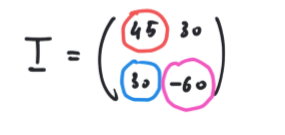
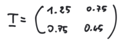

# Cerchi di Mohr

## Esercizio 1

Si determinino per via grafica, tramite la costruzione di Mohr e per via analitica le tensioni e le direzioni principali del seguente stato tensionale piano:

Svolgimento .pdf [Cerchi di Mohr 1.pdf](esercizi_cerchi_di_Mohr.assets\Cerchi di Mohr 1.pdf) 

Svolgimento .explain: [Cerchi di Mohr 1.explain](esercizi_cerchi_di_Mohr.assets\Cerchi di Mohr 1.explain) 

Video: https://web.microsoftstream.com/video/99f74028-a03f-4fa2-a2b7-40d4dfc9275e

## Esercizio 2

 Si determinino per via grafica, tramite la costruzione di Mohr e per via analitica le tensioni e le direzioni principali del seguente stato tensionale piano:

Svolgimento .pdf: [Cerchi di Mohr 2.pdf](esercizi_cerchi_di_Mohr.assets\Cerchi di Mohr 2.pdf) 

Svolgimento .explain: [Cerchi di Mohr 2.explain](esercizi_cerchi_di_Mohr.assets\Cerchi di Mohr 2.explain) 

Video: https://web.microsoftstream.com/video/99f74028-a03f-4fa2-a2b7-40d4dfc9275e?st=4362

