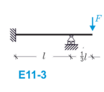
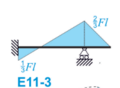
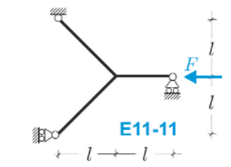
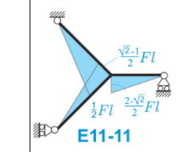
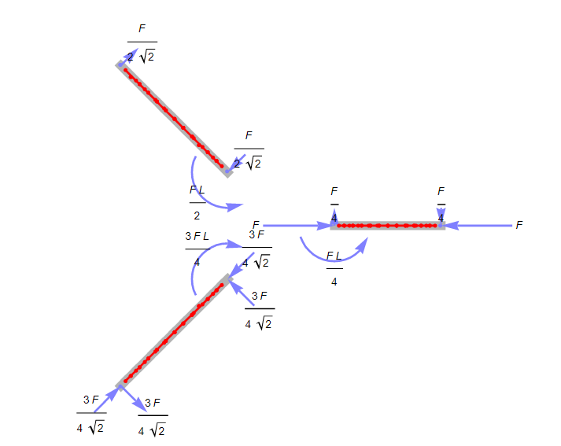

# Errata testo

 [ERRATA CAPITOLO 9.pdf](errata_testo.assets\ERRATA CAPITOLO 9.pdf) 

 [ERRATA CAP 11 e 20.pdf](errata_testo.assets\ERRATA CAP 11 e 20.pdf) 

## Cap 11

### Esercizio svolto 11.2. 

Il diagramma del momento $M_0$ nel tratto BC dovrebbe essere parabolico e non lineare.

### Esercizio proposto 11-1. 

L'esercizio e' corretto.

### Esercizio proposto 11-3. 

Il diagramma sul testo e` il seguente:

Il momento di incastro e' $FL/6$ (positivo), mentre il il momento in corrispondenza dell'appoggio e' $-2FL/3$ (negativo).

Notebook mathematica: [esercizio_proposto_11.3.nb](file_mathematica\esercizio_proposto_11.3.nb) 

### Esercizio proposto 11-11.

Il diagramma e' qualitativamente corretto, ma le quotature sono errate.

il diagramma di struttura libera corretto e':

## Cap 18

### Sezione 18.3.3 Flessione retta $M_Y$

Nella  Figura 18.8 l'asse di flessione $f$ è erroneamente fatto coincidere con l'asse neutro $n$. Ciò è errato, dato che l'asse di flessione risulta sempre ortogonale all'asse neutro. In particolare, l'asse $f$ coincide con l'asse $x$ e con l'asse di sollecitazione $s$.

