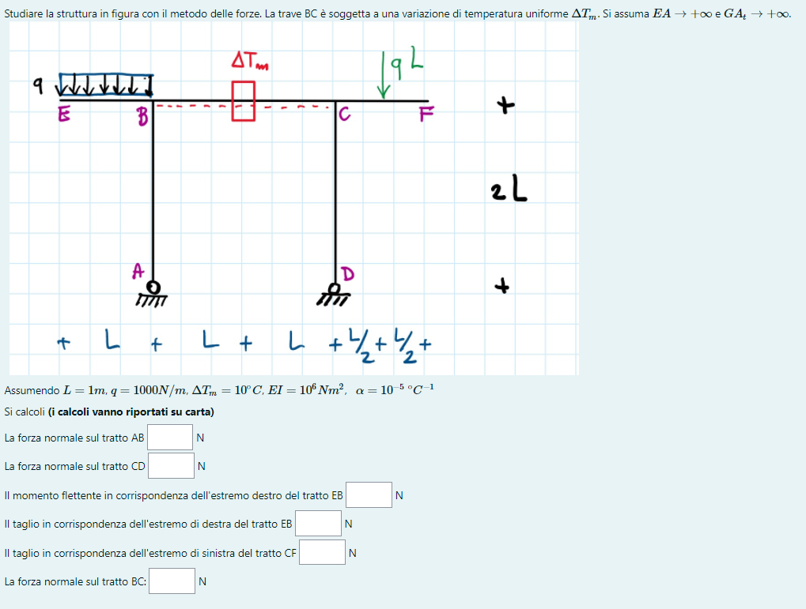
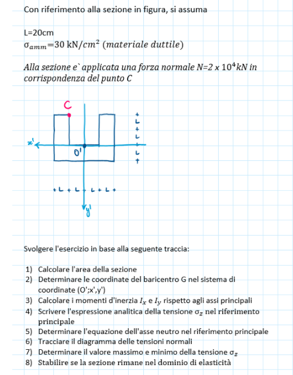

# Esempio di prova scritta.

Attenzione: questo è solo un esempio.

## Esercizio 1.

Un esempio di esercizio 1 è la risoluzione di una struttura iperstatica con il metodo delle forze. In fondo all'esercizio potreste trovare delle domande di controllo a cui rispondere numericamente.

## Esercizio 2.

Il secondo esercizio tipicamente consiste nel determinare lo stato di sforzo di una sezione e valutare se, in base ad un criterio di resistenza assegnato, la sezione rimane o meno nel dominio di elasticità.

