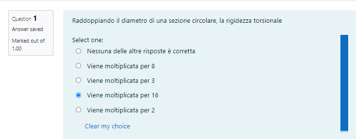

# Quiz di Teoria

Il quiz di teoria copre in genere tutto il programma e consiste in domande oppure in micro-esercizi che dovreste sapere svolgere senza effettuare calcoli (se dovete fare calcoli per rispondere, 30 minuti non saranno sufficienti), o effettuando minimi calcoli. Il tempo a disposizione è 30 minuti. Di norma, vengono proposte tra le 10 e le 15 domande, il cui numero varia a seconda del grado di difficoltà.

In generale, le domande dei quiz **coprono tutto il programma**. L'unico modo per prepararsi alle domande di teoria è **studiare il libro con molta attenzione e approfondimento** (vi prego di non chiedetemi di darvi domande "per esercitarvi"). 

In questa pagina sono mostrati degli esempi di domande "tipo" che potrebbero essere proposte durante il quiz. 

## Cinematica dei sistemi di corpi rigidi

La risposta corretta è E.

In base al I teorema il centro C2 è allineato con C1=A e C12=B. Dato che C2 si trova sulla retta r, esso deve necessariamente coincidere con E.

## Statica dei sistemi di corpi rigidi

La risposta corretta è "Kirchhoff" (si veda la sezione 3.3.1 del libro di testo).

## Cinematica della trave

## Statica della trave

In questo esercizio occorre trascinare il diagramma corrispondente a ciascuna struttura.

Risposta corretta:

Trattandosi di micro-esercizi, a questo tipo di domande dovreste saper rispondere **senza fare calcoli**, **adoperando il ragionamento** e procedendo **per esclusione**. Per prima cosa, si nota che nella struttura in basso a sinistra è applicato un momento sulla sezione incernierata. Quindi in corrispondenza di quella sezione il diagramma del momento è diverso da zero (basta adoperare le condizioni al contorno). Pertanto l'unico diagramma associabile alla struttura in basso a sinistra è l'ultimo tra i quattro in fondo. Analogamente, la struttura in alto a destra ha un momento applicato sulla sommità, quindi l'unico diagramma possibile per tale struttura è il secondo. Si noti che nella struttura in basso a destra la forza è bilanciata dalla cerniera e quindi il carrello non reagisce; pertanto, l'unico diagramma possibile è il primo. Una volta trovati tre diagrammi corretti, il quarto si seleziona automaticamente.

## Materiale costitutivo

## Metodo degli spostamenti

Questa condizione è spiegata sul libro. 

## Problema di Saint Venant

In questo caso la risposta corretta è  la seconda. La terza è una formula corretta, ma vale solo per la torsione, che è un caso particolare del problema di Saint Venant. La quarta formula è la formula di Bredt. La quinta è errata.

## Flessione

## Torsione

Per rispondere a questa domanda occorre ricordare che la rigidezza torsionale di una sezione circolare è $GI_p$ dove $I_p=\pi R^4/2$ è il momento d'inerzia polare. Raddoppiando il diametro, il raggio viene moltiplicato per un fattore 2, quindi la rigidezza viene moltiplicata per un fattore $2^4=16$.

## Criteri di resistenza

Si veda la sezione 22.3 del libro.

---

