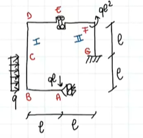

# Risorse corso di Scienza delle Costruzioni

[Programma d'esame](./programmi/index)

[Errata libro di testo](errata_testo.md)

[Notebook del corso AA2021-22](https://uniroma3.sharepoint.com/sites/AA2122-SCIENZADELLECOSTRUZIONI-20801971TOMASSETTI/_layouts/OneNote.aspx?id=%2Fsites%2FAA2122-SCIENZADELLECOSTRUZIONI-20801971TOMASSETTI%2FSiteAssets%2FBlocco%20appunti%20AA21-22%20-%20SCIENZA%20DELLE%20COSTRUZIONI%20-%2020801971%20%28TOMASSETTI%29&wd=target%28Sdc%20Ing%20Mec%202021-22%29)

## Files .explain del corso

[Lezioni](./lezioni/classes)

## Modalità di esame

[Pagina esplicativa sulle modalità di esame su terminale](Modalità di esame su terminale)

## [Appelli di esame per il corso di Ingegneria Meccanica](esami_meccanici/appelli_esame)

## Esercitazioni per il corso di Ingegneria Meccanica

[Indicazioni per lo svolgimento delle esercitazioni](svolgimento_esercitazioni\main.pdf) 

Nella [seguente pagina](Esercitazioni/esercitazioni.md) riporto degli svolgimenti di esercitazioni molto ben curati, gentilmente forniti dagli studenti, **che ringrazio vivamente.**

Nota bene: nelle esercitazioni degli anni passati potrete trovare **svolti molti degli esercizi proposti nel libro di testo**. 

**Vi consiglio dunque di studiarle con attenzione.**

## Diagrammi delle caratteristiche della sollecitazione

[Esercizio svolto sui diagrammi delle caratteristiche della sollecitazione (13 dicembre 2021)](https://web.microsoftstream.com/video/318289c4-c9d7-4a64-be66-f5cf327f5232?st=10)

## Cerchi di Mohr

[Esercizi su cerchi di Mohr](cerchi_di_mohr/esercizi_cerchi_di_Mohr)

[Software in linea per la visualizzazione dei cerchi di Mohr](https://mechanicalc.com/calculators/mohrs-circle/)

## Risorse video su argomenti facoltativi 

## [Travature reticolari](travature_reticolari/travature_reticolari)

## [Equazione dei tre momenti](equazione_dei_tre_momenti/equazione_dei_tre_momenti.md)

## [Taglio non uniforme: formula di Jourawsky](taglio_non_uniforme/taglio_non_uniforme)

## Risorse esterne

Applicazione per esercitarsi Schnittkraftmeister https://www.tugraz.at/institute/ifb/software/schnittkraftmeister/

Applicazione [Explain Everything](https://explaineverything.com/) per aprire i file in formato .explain che vi permettono la visualizzazione "animata degli appunti".

"Paolone, Vestroni, Vidoli: Scienza delle Costruzioni: l'analisi della tensione nelle travi. Un software applicativo. Casa Editrice Ambrosiana" contenente dSVSolve, un pacchetto di *Mathematica* per risolvere esercizi di Scienza delle Costruzioni. Per istruzioni consultare questa pagina: [stefanovidoli - DIDATTICA (uniroma1.it)](https://stefanovidoli.site.uniroma1.it/insegnamenti)

Pagina con le istruzioni per scaricare il software Wolfram Mathematica per gli studenti di Roma Tre: [Wolfram Mathematica - Università Roma Tre (uniroma3.it)](https://www.uniroma3.it/servizi/software-in-convenzione/wolfram-mathematica/)

---

